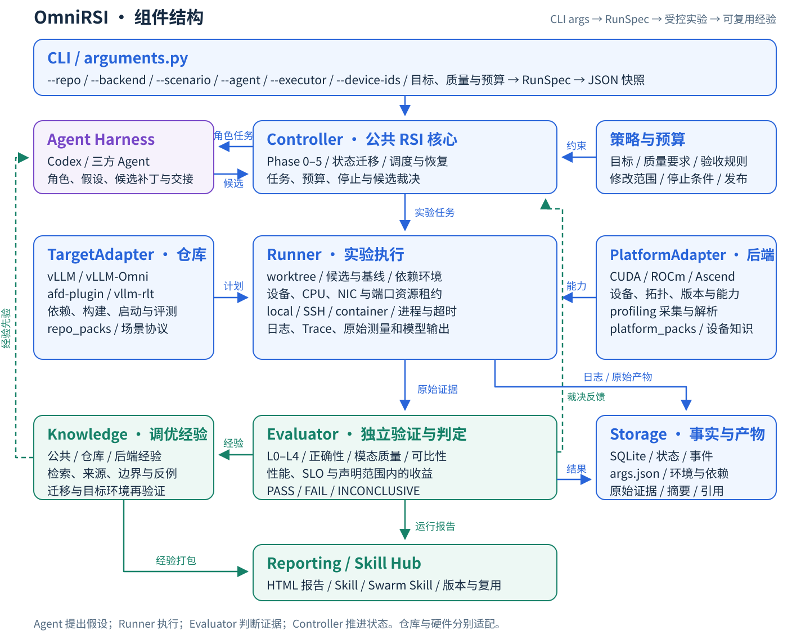
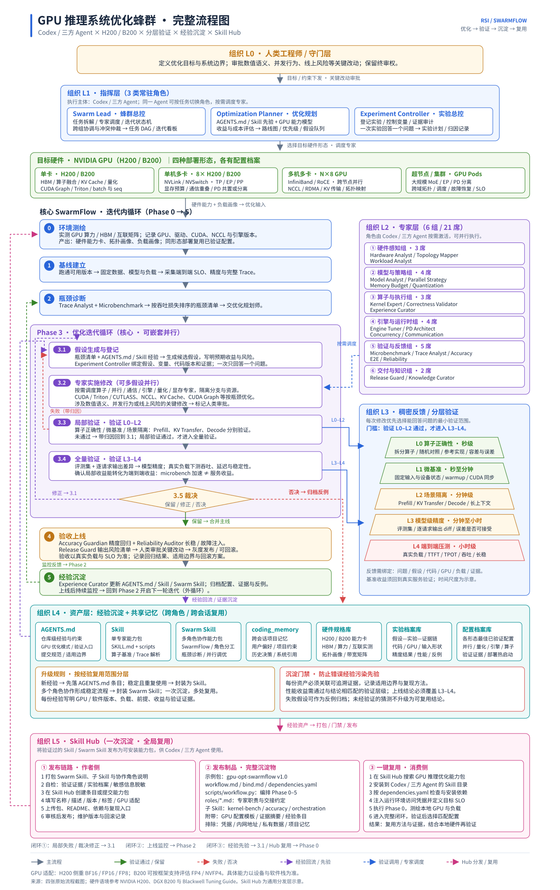

# Architecture and first-release boundary

## Components



The diagram is the target architecture from the reviewed plan. This first release maps its measurable slice to a few real modules rather than creating empty packages:

| Responsibility | Initial implementation |
| --- | --- |
| CLI -> RunSpec | arguments.py / cli.py / contracts.py |
| Repository/backend inspection | inspection.py and versioned descriptors |
| Execution, local state and deadlines | execution.py and JSON evidence |
| Independent metric/quality gates | evaluation.py |
| Read-only knowledge retrieval and manual handoff | catalog.py / context command |
| HTML evidence report | reporting.py |
| Autonomous Agent/Planner, source patches, SSH executor, leases, Hub publication | Later work; not simulated |

The local executor is suitable for installing directly on the user's prepared remote machine. Shared configuration uses CLI arguments; JSON is for immutable evidence and package metadata. Separate candidate cwd does not isolate Python imports, resource allocation or a pre-existing server; the caller prepares those explicitly.

## Workflow



The original workflow is retained as the long-term design reference. Its hardware panel illustrates the GPU lane. ROCm/Ascend have independent package-data namespaces and environment inspection, and must establish their own compatibility/evidence.

The implemented path freezes the caller's external-command contract, fingerprints baseline/candidate source, measures AB/BA trials, runs explicit validation, applies gates and writes a report. Caller-supplied candidates and manual cited context bridge the planning/Agent stages; these stages are not automatically executed or falsely marked complete.

## Knowledge ownership

Package data is the canonical storage location:

```text
omnirsi/data/repo_packs/REPO/knowledge/experiences/BACKEND/diffusion/ENTRY/
  experience.json      source, scope, applicability, verification, claims
  README.md            how to use, remote validation, limitations
omnirsi/data/platform_packs/BACKEND/pack.json
```

General guidance uses `diffusion.*`; concrete cases retain image/video task scope. A ROCm filter can retrieve common methods but cannot inherit a CUDA or Ascend case. SKU, software, model and workload constraints remain in the handoff and require manual qualification.

Imported skills are source material, not executable tool authority. All seeded records remain imported; the CLI does not change them to validated based on unrelated tests.

## Decisions

- A standard-library control package keeps CPU development independent of large engine environments.
- External command adapters preserve existing benchmarks without duplicating engine internals. The cost is caller-owned launch/quality protocols and environment fairness.
- Local JSON evidence is sufficient for one serial experiment. Distributed leases, durable recovery and a multi-user state store require a later design.
- Bundled canonical knowledge makes a noneditable wheel usable without a source checkout. References use pinned source commits and PR states; live upstream changes require a new import/review.
